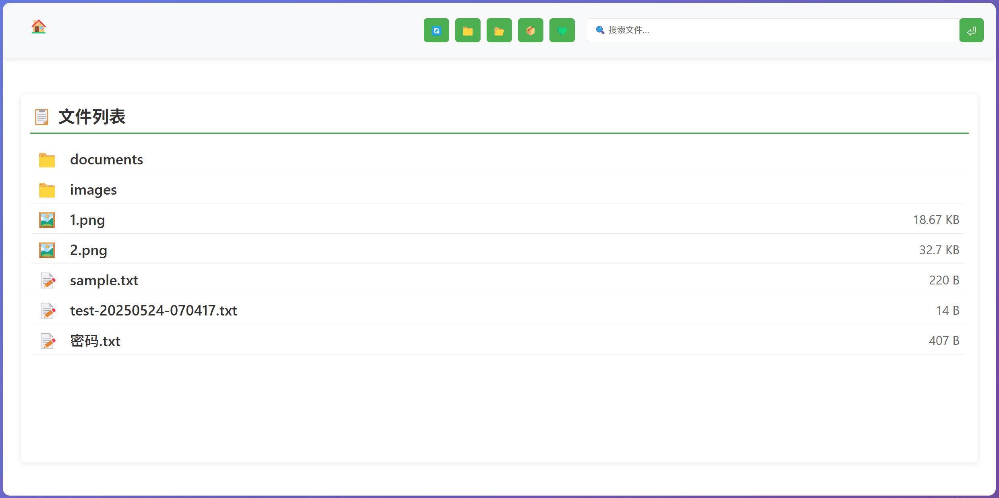

# 🥭 Mango - Dufs 现代化主题

[](https://github.com/uuzp/dufs_theme_mango/releases)
[](LICENSE)



一个为 [Dufs](https://github.com/sigoden/dufs) 文件服务器设计的现代化、原生体验的 Web 文件管理器主题。

> 📋 [查看更新日志](CHANGELOG.md) | 🐛 [报告问题](https://github.com/uuzp/dufs_theme_mango/issues)

## ✨ 特性

### 🖱️ 原生文件操作体验
- **单击操作**：单击文件下载，单击文件夹进入
- **右键菜单**：丰富的上下文菜单操作（下载、哈希、重命名、属性、删除）
- **拖拽移动**：在文件夹间拖拽移动文件，支持面包屑导航拖拽

### 📤 智能上传系统
- **拖拽上传**：将文件拖拽到页面任意位置即可上传
- **批量上传**：支持多文件同时上传
- **进度显示**：实时显示上传进度

### 🔍 快速搜索
- **即时搜索**：输入关键词快速搜索文件
- **专注模式**：搜索时隐藏文件列表，专注搜索结果
- **智能清除**：多种方式返回正常浏览模式

### 🔐 文件安全
- **SHA256哈希**：一键获取文件哈希值
- **复制功能**：哈希值一键复制到剪贴板
- **底部显示**：15秒展示时间，方便查看复制

### 📱 响应式设计
- **移动友好**：完美适配手机和平板设备
- **现代UI**：简洁美观的用户界面
- **流畅动画**：丰富的交互动画效果

## 🚀 快速开始

### 方法一：使用 PowerShell（推荐）
```powershell
# 克隆项目
git clone https://github.com/uuzp/dufs_theme_mango.git
cd dufs_theme_mango

# 运行启动脚本（自动下载 dufs.exe）
.\start.ps1
```

### 方法二：使用批处理文件（简单快捷）
```cmd
# 克隆项目
git clone https://github.com/uuzp/dufs_theme_mango.git
cd dufs_theme_mango

# 运行启动脚本（自动调用 PowerShell 下载 dufs.exe）
start.bat
```

### 方法三：Linux/macOS
```bash
# 克隆项目
git clone https://github.com/uuzp/dufs_theme_mango.git
cd dufs_theme_mango

# 运行启动脚本（自动下载 dufs）
chmod +x start.sh
./start.sh
```

### 方法四：手动安装
1. 下载本项目
2. 从 [Dufs Releases](https://github.com/sigoden/dufs/releases/latest) 下载对应系统的 dufs 可执行文件
3. 将可执行文件重命名为 `dufs.exe` (Windows) 或 `dufs` (Linux/macOS)
4. 运行 `dufs --config dufs.yaml`

## 📁 项目结构

```
dufs_theme_mango/
├── html/                  # 主题文件
│   ├── index.html         # 主页面
│   ├── script.js          # 核心功能脚本
│   ├── style.css          # 样式文件
│   └── favicon.png        # 图标
├── data/                  # 数据目录（自动创建）
├── dufs.yaml             # Dufs 配置文件
├── start.ps1             # PowerShell 启动脚本
├── start.bat             # 批处理启动脚本（调用 PowerShell）
├── start.sh              # Linux/macOS 启动脚本
└── README.md             # 本文档
```

## ⚙️ 配置说明

### dufs.yaml 主要配置项
```yaml
serve-path: './data'       # 服务目录
bind: 0.0.0.0             # 绑定地址
port: 5000                # 端口号
allow-all: true           # 允许所有操作
assets: "./html"          # 自定义主题目录
enable-cors: true         # 启用CORS
compress: medium          # 压缩级别
```

### 启动脚本功能对比
| 脚本 | 自动下载 | 依赖 | 说明 |
|------|----------|------|------|
| `start.ps1` | ✅ | PowerShell | 完整功能，推荐使用 |
| `start.bat` | ✅ | PowerShell | 自动调用 PowerShell 脚本 |
| `start.sh` | ✅ | curl/wget | Linux/macOS 使用 |

## 🎯 使用指南

### 文件操作
- **下载文件**：单击文件名
- **进入文件夹**：单击文件夹名
- **查看更多操作**：右键点击文件/文件夹
- **移动文件**：拖拽文件到目标文件夹或面包屑路径

### 上传文件
- **拖拽上传**：将文件拖拽到浏览器窗口
- **选择上传**：点击 📁 按钮选择文件

### 搜索文件
- **开始搜索**：在搜索框输入关键词，按回车或点击搜索
- **返回浏览**：清空搜索框、点击"返回文件列表"或点击任意导航路径

### 文件哈希
- **获取哈希**：右键点击文件，选择"获取哈希"
- **复制哈希**：在底部状态栏点击"复制哈希值"按钮

## 🌐 访问地址

启动后可通过以下地址访问：
- 本地访问：http://127.0.0.1:5000
- 局域网访问：http://你的IP地址:5000

## 🛠️ 开发与自定义

### 修改主题
1. 编辑 `html/style.css` 修改样式
2. 编辑 `html/script.js` 修改功能
3. 编辑 `html/index.html` 修改结构

### 自定义配置
1. 编辑 `dufs.yaml` 修改服务器配置
2. 重启服务生效

## 📋 系统要求

- **Windows**: Windows 7+ (推荐 Windows 10+)
- **macOS**: macOS 10.12+
- **Linux**: 任何现代 Linux 发行版
- **浏览器**: Chrome 60+, Firefox 55+, Safari 12+, Edge 79+

## 🤝 贡献

欢迎提交 Issue 和 Pull Request！

### 开发设置
```bash
git clone https://github.com/uuzp/dufs_theme_mango.git
cd dufs_theme_mango

# 启动开发环境
.\start.ps1  # 或 start.bat

# 修改 html/ 目录下的文件
# 刷新浏览器查看更改
```

## 📄 许可证

本项目采用 [MIT License](LICENSE) 许可证。

该许可证与 [Dufs](https://github.com/sigoden/dufs) 项目的 MIT 许可证兼容，确保了良好的开源生态兼容性。

## 🙏 致谢

- [Dufs](https://github.com/sigoden/dufs) - 优秀的文件服务器
- 所有贡献者和用户的反馈

## 📞 支持

如果你喜欢这个项目，请给个 ⭐ Star！

有问题？请提交 [Issue](https://github.com/uuzp/dufs_theme_mango/issues)